
【Ｗｅｌｃｏｍｅ】
 

 

 
Hi, I'm Kevin Padilla, a blockchain developer 👨‍💻 from Mexico.

- Founder of 0xBlockLab, a web3/blockchain university community at Benemérita Universidad Autónoma de Puebla.
- Arbitrum ambassador.
- Developer at [Roll A Mate](https://x.com/RollAMate)

**Gender**: Non-binary (She/He  El/Ella)

**Languages**: Engish and Spanish (Native) 

 

【Ｃｏｎｔａｃｔ】

 
 
 
 

 

【Ｃｈｅｃｋ　ｍｙ　ｐｏｒｔｆｏｌｉｏ　ｂｙ　ｃｌｉｃｋｉｎｇ　ｈｅｒｅ】

 

 
【Ｌａｎｇｕａｇｅｓ　ａｎｄ　Ｔｏｏｌｓ】

 
 

        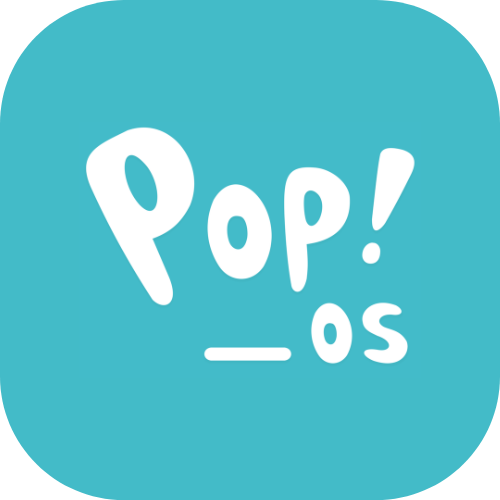
        
        
        
        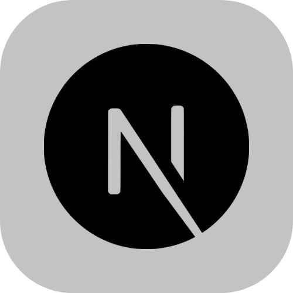
        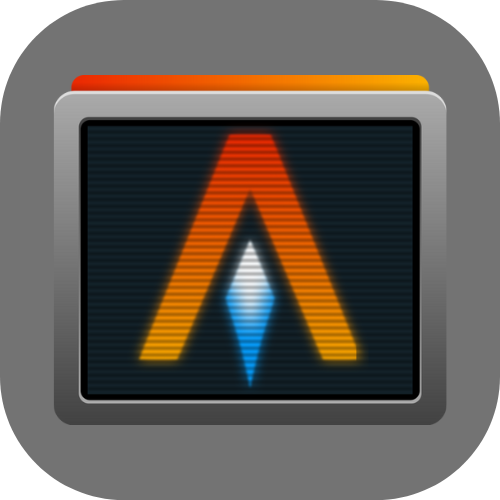
        
        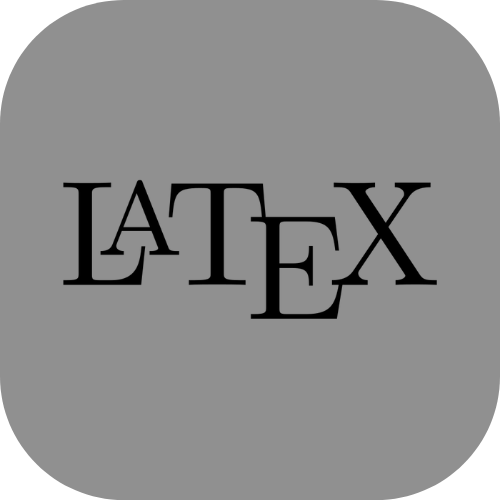
        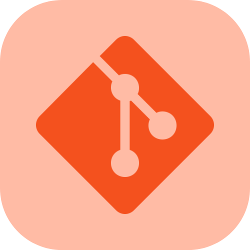
        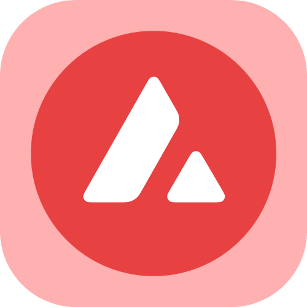
        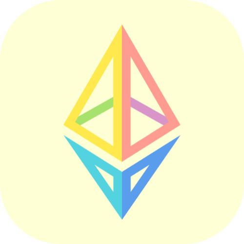
        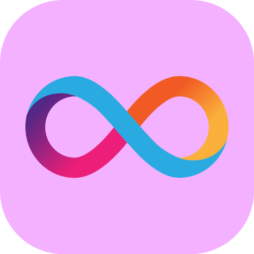
        
        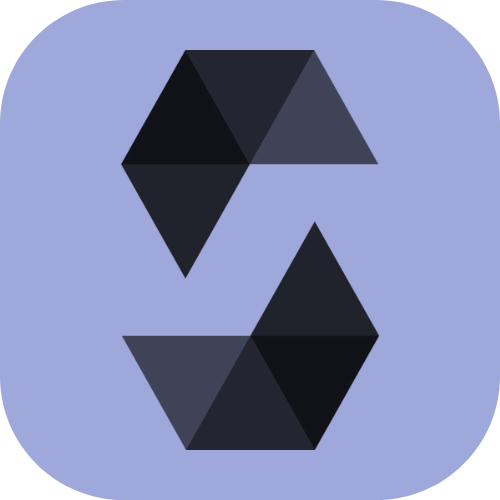
        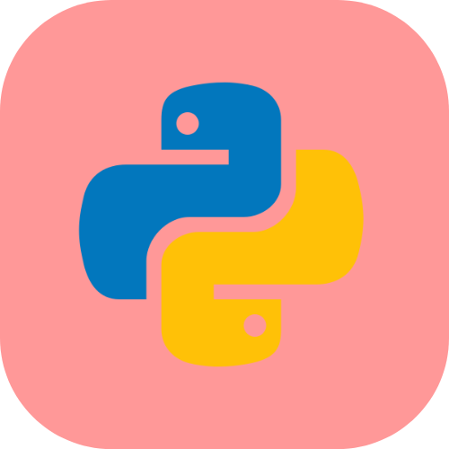
        
        
        
        

 
        

        <b>【Ｍｙ　ｃｅｒｔｉｆｉｃａｔｉｏｎｓ　ａｎｄ　ｂａｄｇｅｓ】</b>
        
 
        

        

                <a href="https://www.coursera.org/account/accomplishments/certificate/TVQVJFSFKRZQ">
                        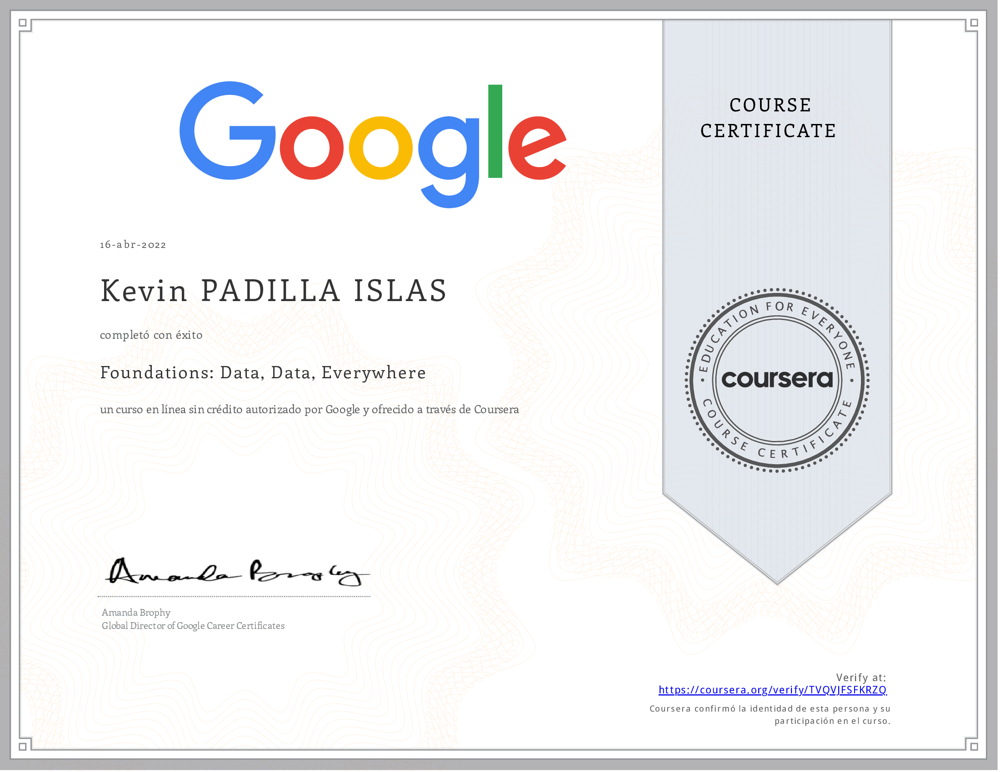
                </a>
                
                
                
                
                
                <a href="https://www.credly.com/badges/5afd023a-6125-4ce7-a321-d202871a0db7/">
                        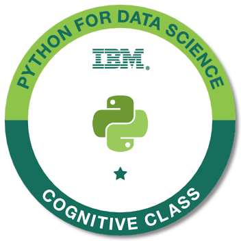
                </a>
                <a href="https://www.credly.com/badges/f8bfc804-98d6-4c98-a7ea-cc7564a81673/">
                        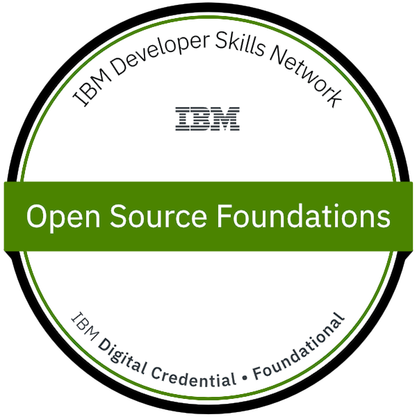
                </a>
                <a href="https://www.credly.com/badges/dc6fc5f6-9452-4dd5-a67c-93914a4c5396/">
                        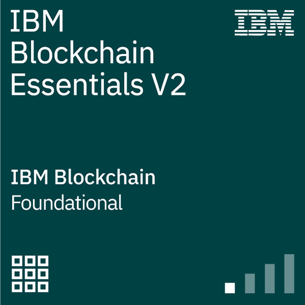
                </a>
                <a href="https://www.credly.com/badges/b52e2e46-54bd-4e84-8bb0-fe0016615396/">
                        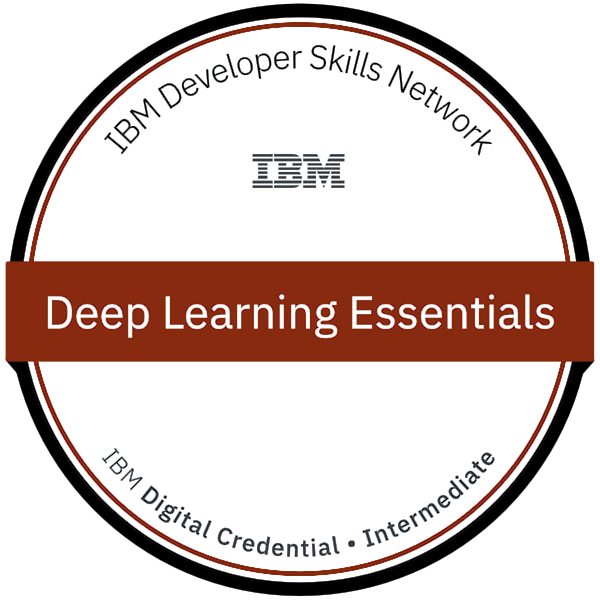
                </a>
                
                
                <a href="https://github.com/jistro/jistro/blob/main/certs/icpC01.pdf">
                        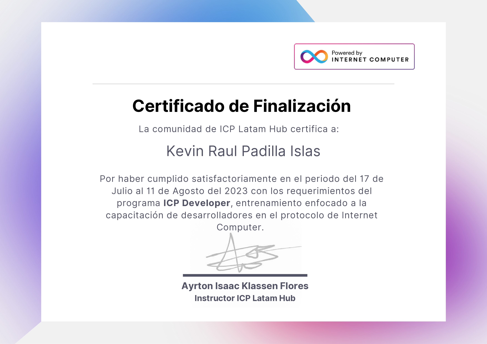
                </a>
                
                <a href="https://github.com/jistro/jistro/blob/main/certs/avaxC02.pdf">
                        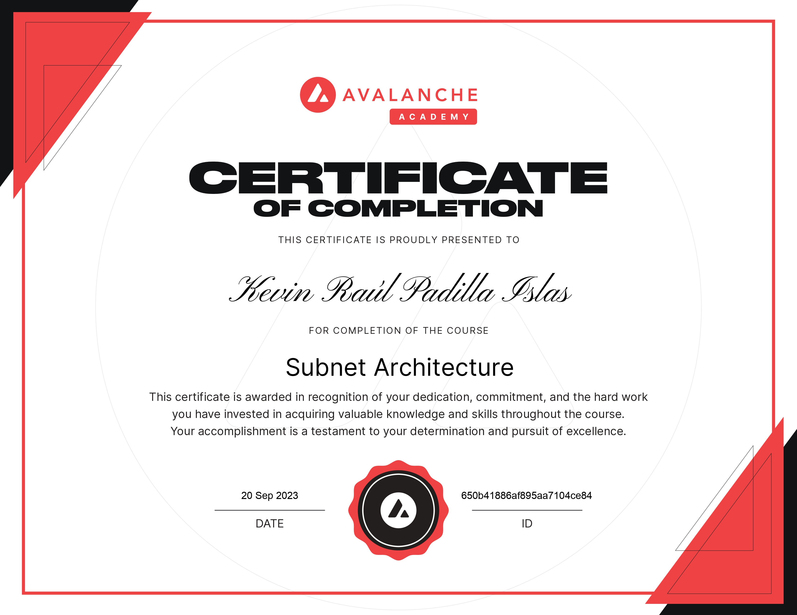
                </a>
        

        
【Ｏｔｈｅｒ　ｃｏｕｒｓｅｓ】

        

                <a href="https://github.com/Cyfrin/foundry-full-course-f23">
                        <b>Blockchain Developer, Smart Contract, & Solidity Course - Powered By AI - Beginner to Expert Course | Foundry Edition 2023</b>
                </a>
        

        

        <a href="https://opensea.io/account?search[collections][0]=foundry-course-nft">
                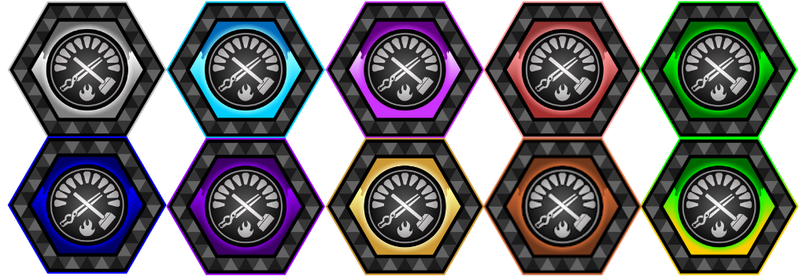
        </a>
        

        
【Ｒｅｌｅｖａｎｔ　ＰＯＡＰ＇Ｓ】

        

        <a href="https://explorer.poap.xyz/jistro.eth/6570664">
        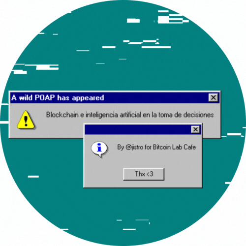
        </a>
        <a href="https://explorer.poap.xyz/jistro.eth/6637780">
        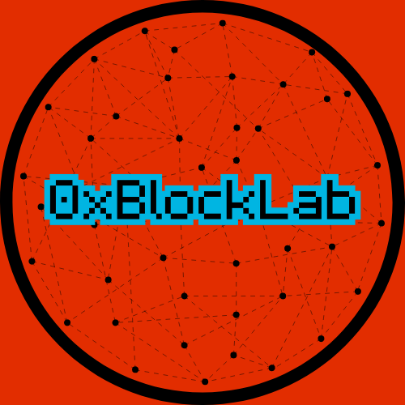
        </a>
        
        
        <a href="https://explorer.poap.xyz/jistro.eth/6737526">
        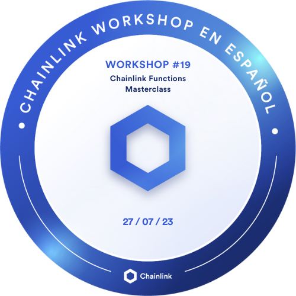
        </a>
        <a href="https://explorer.poap.xyz/jistro.eth/6747280">
        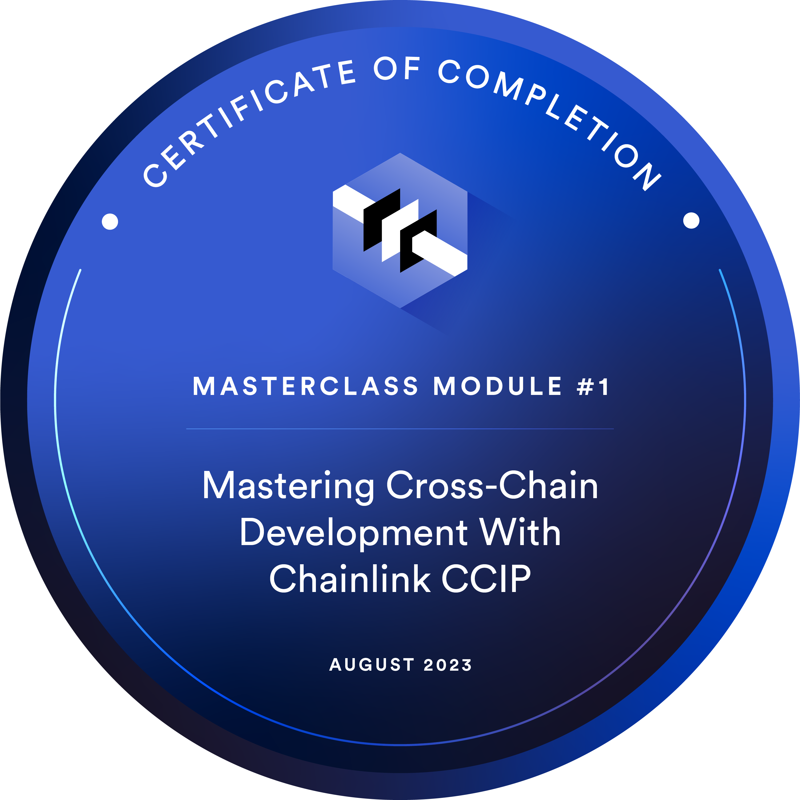
        </a>
        

        

        <a href="https://explorer.poap.xyz/jistro.eth">
        <b>More POAP's</b>
        </a>
        

【Ｓｏｍｅ　ｆｕｎ　ｓｔａｔｓ】

