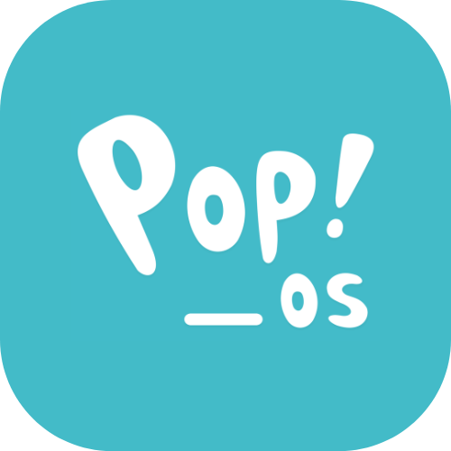

【Ｗｅｌｃｏｍｅ】

 

【Ａｂｏｕｔ　Ｍｅ】

Hi, I'm Kevin Padilla, an entry-level data scientist and blockchain engineer 👨‍💻 from Mexico. 
I am the founder of 0xBlockLab, a web3/blockchain university community at Benemerita Universidad Autonoma de Puebla.

**Gender**: Non-binary (She/He  El/Ella)

**Languages**: Engish and Spanish (Native) 

【Ｃｏｎｔａｃｔ】

 
【Ｌａｎｇｕａｇｅｓ　ａｎｄ　Ｔｏｏｌｓ】

 

 Things I use or learn on a daily basis:
 

        
        
        
        
        
        
        
        
        
        
        
        
        
        
        
        
        

