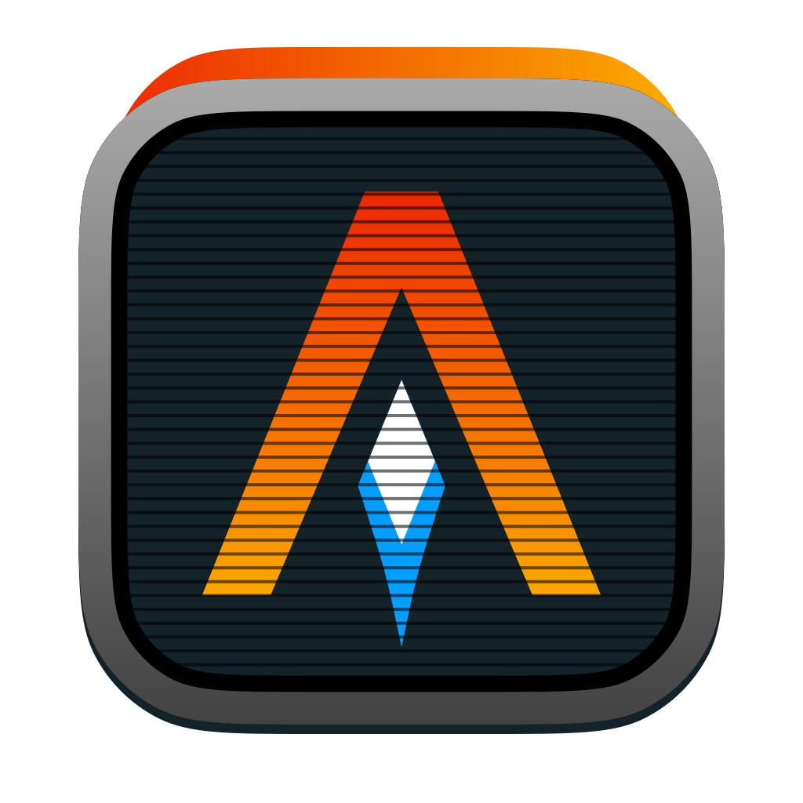

【Ｗｅｌｃｏｍｅ】

 

    

---

【Ａｂｏｕｔ　Ｍｅ】

Entry level data scientist 👨‍💻 from Mexico

**Gender**: Non-binary (Him/Her  El/Ella)

【Ｌａｎｇｕａｇｅｓ　ａｎｄ　Ｔｏｏｌｓ】

Things I use on a daily basis:

Things I'm learning:

  
  
  
  
  
  
  

【Ｍｙ　Ｓｔａｔｓ】

