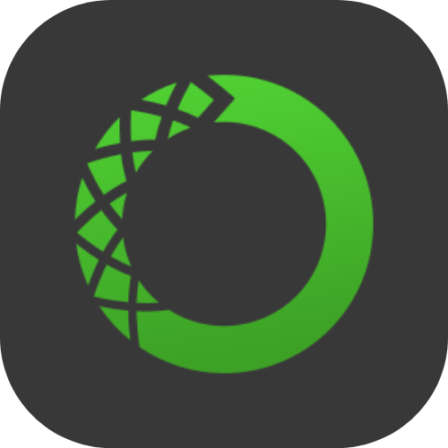
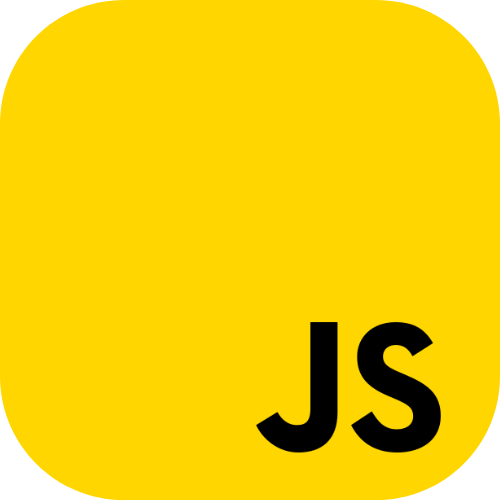

【Ｗｅｌｃｏｍｅ】

 

【Ａｂｏｕｔ　Ｍｅ】

Hi, I'm Kevin Padilla, an entry-level data scientist and blockchain engineer 👨‍💻 from Mexico. 
I am the founder of 0xBlockLab, a web3/blockchain university community at Benemerita Universidad Autonoma de Puebla.

**Gender**: Non-binary (Him/Her  El/Ella)

**Languages**: Engish and Spanish (Native) 

【Ｃｏｎｔａｃｔ】

<a href="https://bento.me/jistro">
        

     <a href="mailto:kevin.padilla.islas@proton.me">
        

     

 
【Ｌａｎｇｕａｇｅｓ　ａｎｄ　Ｔｏｏｌｓ】

 

 Things I use on a daily basis:
 

 
 
 
 
 
 
 

 Things I'm learning:
 

   
   
   
   
   
   
   
   
 

